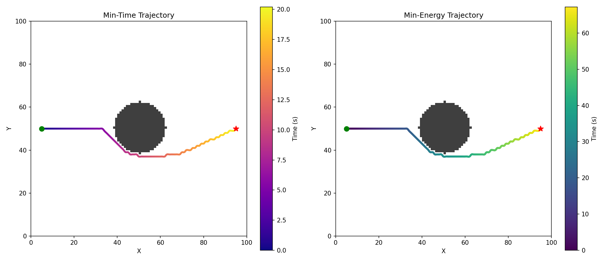

# UAV path planning project
**what did you build ?**
* This project is about UAV path planning.
* I used a V-shape formation for the UAVs.
* There are a total of 5 UAVs in the system.
* I used the A* algorithm for path planning.

**SETUP :**
* First, clone the repository using `git clone https://github.com/Divya-ase/uav-path-planning.git`
* Then go to the project folder using `cd uav-path-planning/end_term`
* Finally, install the required libraries using `pip install -r requirements.txt`

**How to run ?**

* Run the program using `python simulate.py`
* When it runs, it opens a window showing the UAVs moving in formation along the planned path.
* It also saves the output as a GIF file in the `results` folder.
* Some basic information or metrics may also be printed in the terminal.

**What each script does ?**

* map_setup.py — defines the grid, obstacles, and start/goal positions.
* path_planner.py — uses A* algorithm to find a path from start to goal.
* trajectory.py — converts the path into smooth trajectories for UAVs.
* formation.py — manages the V-shape formation and UAV positions.
* simulate.py — runs the full simulation and shows animation and results.

**Results**

* The minimum-time trajectory is faster compared to the minimum-energy trajectory.
* The minimum-energy trajectory uses less energy but takes more time to reach the goal.
* The difference is small, but there is a clear trade-off between speed and energy efficiency.

**Formation Details**

* I used a V-shape formation for the UAVs.
* The total number of UAVs is 5.
* Each UAV is assigned a fixed position in the formation based on its index to maintain proper spacing.

